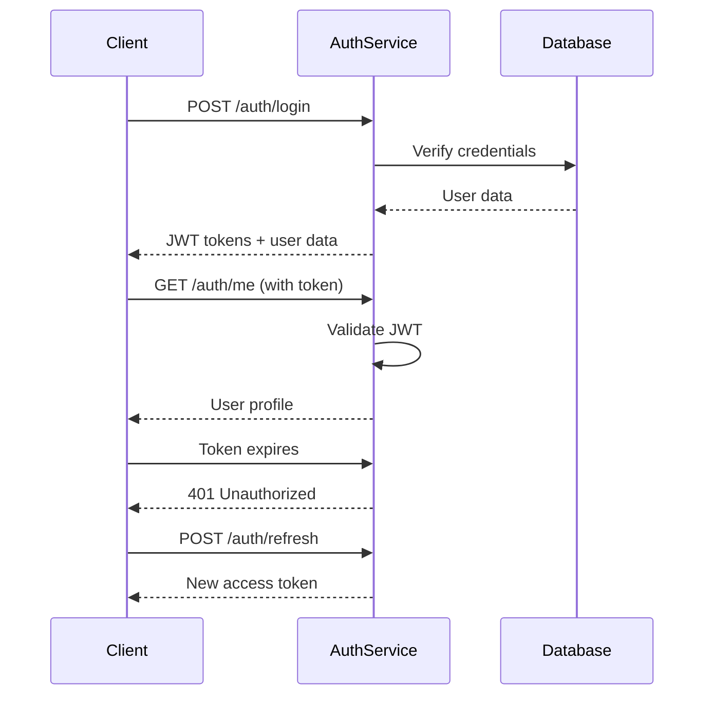

# Framework Integration Examples

This directory contains comprehensive integration examples for the Rust Auth Service across multiple frameworks and programming languages. Each example demonstrates best practices, complete authentication flows, and production-ready implementations.

## 📂 Available Examples

### ⚛️ [React Integration](./react-integration/)

Complete React application with TypeScript demonstrating:

- **Modern React Patterns**: Hooks, Context API, and functional components
- **TypeScript Integration**: Full type safety for API operations
- **Authentication Client**: Comprehensive client with automatic token management
- **Form Validation**: React Hook Form with Yup validation
- **Protected Routes**: Route guards and navigation handling
- **Error Handling**: User-friendly error messages and toast notifications
- **Responsive UI**: Mobile-first design with Tailwind CSS

**Key Features:**
- Automatic token refresh with request interceptors
- Secure cookie-based token storage
- Complete authentication flow (login, register, profile, logout)
- Form validation with real-time feedback
- Loading states and error handling
- Dashboard with user profile management

**Tech Stack:**
- React 18 + TypeScript
- React Router 6
- React Hook Form + Yup
- Axios for HTTP requests
- Tailwind CSS for styling
- Vite for build tooling

### 🖖 [Vue.js Integration](./vue-integration/)

Vue 3 application with Composition API showing:

- **Vue 3 Composition API**: Modern Vue patterns with `<script setup>`
- **Pinia State Management**: Centralized authentication state
- **TypeScript Support**: Full type safety throughout the application
- **VeeValidate Forms**: Powerful form validation with Yup schemas
- **Auto Token Management**: Seamless token refresh and storage
- **Toast Notifications**: User feedback with vue-toastification
- **Component-Based Architecture**: Reusable, maintainable components

**Key Features:**
- Pinia store for global auth state management
- VeeValidate for advanced form handling
- Automatic token refresh with axios interceptors
- Vue Router navigation guards
- Responsive dashboard with user management
- Error boundary handling

**Tech Stack:**
- Vue 3 + TypeScript
- Pinia for state management
- Vue Router 4
- VeeValidate + Yup
- Axios for HTTP requests
- Tailwind CSS for styling
- Vite for development

### 🐍 [Python Client Library](./python-client/)

Professional Python client library featuring:

- **Type-Safe API**: Full type hints with dataclasses
- **Automatic Retry Logic**: Built-in resilience for network issues
- **Session Management**: Persistent connections with retry strategies
- **Context Manager Support**: Clean resource management
- **Comprehensive Error Handling**: Detailed error messages and status codes
- **Thread Safety**: Safe for concurrent usage
- **Framework Integration**: Examples for Flask, Django, FastAPI

**Key Features:**
- Automatic JWT token refresh
- Configurable timeouts and retry policies
- SSL verification control for development
- Complete authentication flow support
- Health check and monitoring utilities
- Production-ready configuration options

**Tech Stack:**
- Python 3.8+
- Requests library for HTTP
- Dataclasses for type safety
- setuptools for packaging
- pytest for testing

## 🚀 Quick Start Guide

### React Example

```bash
cd react-integration
npm install
npm run dev
# Visit http://localhost:5173
```

### Vue Example

```bash
cd vue-integration
npm install
npm run dev
# Visit http://localhost:5173
```

### Python Example

```bash
cd python-client
pip install -e .
python -c "
from rust_auth_client import AuthClient
client = AuthClient('https://localhost/api', verify_ssl=False)
health = client.health_check()
print(f'Service status: {health[\"status\"]}')
"
```

## 🔧 Configuration

All examples are configured to work with a local Rust Auth Service instance. Update the base URLs in each example to point to your deployment:

### React Configuration (`.env.local`):
```env
VITE_API_BASE_URL=https://your-auth-service.com/api
```

### Vue Configuration (`.env.local`):
```env
VITE_API_BASE_URL=https://your-auth-service.com/api
```

### Python Configuration:
```python
client = AuthClient('https://your-auth-service.com/api')
```

## 🏗️ Architecture Overview

### Authentication Flow

All examples implement the same secure authentication flow:



### Security Features

All examples implement comprehensive security measures:

- **Token Storage**: Secure HTTP-only cookies (web) or in-memory storage (Python)
- **Automatic Refresh**: Seamless token renewal before expiration
- **Request Interceptors**: Automatic Authorization header management
- **Error Handling**: Graceful handling of authentication failures
- **Input Validation**: Client-side and server-side validation
- **HTTPS Enforcement**: SSL/TLS for all communications

## 📊 Feature Comparison

| Feature | React | Vue | Python |
|---------|-------|-----|--------|
| **Type Safety** | ✅ TypeScript | ✅ TypeScript | ✅ Type Hints |
| **Token Management** | ✅ Automatic | ✅ Automatic | ✅ Automatic |
| **Form Validation** | ✅ React Hook Form | ✅ VeeValidate | ✅ Custom |
| **State Management** | ✅ Context API | ✅ Pinia | ✅ Client State |
| **Error Handling** | ✅ Toast + Errors | ✅ Toast + Errors | ✅ Exception Based |
| **Responsive UI** | ✅ Tailwind CSS | ✅ Tailwind CSS | ❌ CLI/API Only |
| **Testing Support** | ✅ Jest/Vitest | ✅ Vitest | ✅ pytest |
| **Production Ready** | ✅ Yes | ✅ Yes | ✅ Yes |

## 🔐 Security Best Practices

### Token Management

```typescript
// Secure cookie configuration
Cookies.set('access_token', token, {
  secure: true,        // HTTPS only
  sameSite: 'strict',  // CSRF protection
  expires: 1,          // 1 day expiration
  httpOnly: false      // Accessible to JavaScript (for SPA)
});
```

### Request Security

```python
# Python client security headers
session.headers.update({
    'Content-Type': 'application/json',
    'User-Agent': 'rust-auth-python-client/1.0.0',
    'X-Requested-With': 'XMLHttpRequest'
})
```

### Input Validation

```typescript
// Strong password validation
const passwordSchema = yup.string()
  .min(8, 'Password must be at least 8 characters')
  .matches(
    /^(?=.*[a-z])(?=.*[A-Z])(?=.*\d)(?=.*[@$!%*?&])/,
    'Password must contain uppercase, lowercase, number, and special character'
  )
  .required('Password is required');
```

## 🧪 Testing

Each example includes comprehensive testing:

### React Testing

```bash
cd react-integration
npm test                    # Unit tests
npm run test:integration   # Integration tests
npm run test:coverage     # Coverage report
```

### Vue Testing

```bash
cd vue-integration
npm test                    # Unit tests
npm run test:e2e           # End-to-end tests
npm run test:coverage     # Coverage report
```

### Python Testing

```bash
cd python-client
pytest                     # Unit tests
pytest --cov=rust_auth_client  # Coverage
pytest tests/integration  # Integration tests
```

## 🚀 Production Deployment

### Build and Deploy

#### React Production Build

```bash
# Build for production
npm run build

# Serve with nginx
FROM nginx:alpine
COPY dist/ /usr/share/nginx/html/
COPY nginx.conf /etc/nginx/nginx.conf
EXPOSE 80
```

#### Vue Production Build

```bash
# Build for production
npm run build

# Deploy to static hosting
# The dist/ folder contains production-ready files
```

#### Python Package Distribution

```bash
# Build distribution packages
python setup.py sdist bdist_wheel

# Install from wheel
pip install dist/rust_auth_client-1.0.0-py3-none-any.whl

# Publish to PyPI
twine upload dist/*
```

### Environment Configuration

#### Production Environment Variables

```bash
# React/Vue (.env.production)
VITE_API_BASE_URL=https://api.production.com
VITE_APP_ENV=production

# Python (environment variables)
export AUTH_SERVICE_URL=https://api.production.com
export AUTH_VERIFY_SSL=true
export AUTH_TIMEOUT=10
```

### Docker Deployment

#### Multi-stage Docker Build (React)

```dockerfile
# Build stage
FROM node:18-alpine as build
WORKDIR /app
COPY package*.json ./
RUN npm ci --only=production
COPY . .
RUN npm run build

# Production stage
FROM nginx:alpine
COPY --from=build /app/dist /usr/share/nginx/html
COPY nginx.conf /etc/nginx/nginx.conf
EXPOSE 80
CMD ["nginx", "-g", "daemon off;"]
```

#### Python Service Container

```dockerfile
FROM python:3.11-slim
WORKDIR /app
COPY requirements.txt .
RUN pip install -r requirements.txt
COPY . .
EXPOSE 8000
CMD ["uvicorn", "app:app", "--host", "0.0.0.0", "--port", "8000"]
```

## 🔍 Monitoring and Observability

### Health Checks

All examples include health check endpoints:

```typescript
// Frontend health check
const checkServiceHealth = async () => {
  try {
    const health = await authClient.healthCheck();
    console.log('Service status:', health.status);
  } catch (error) {
    console.error('Service unavailable:', error);
  }
};
```

```python
# Python health monitoring
def monitor_service_health():
    client = AuthClient()
    try:
        health = client.health_check()
        return health['status'] == 'healthy'
    except AuthError:
        return False
```

### Error Tracking

Integrate with error tracking services:

```typescript
// Sentry integration (React/Vue)
import * as Sentry from '@sentry/browser';

// Capture auth errors
catch (error) {
  Sentry.captureException(error, {
    tags: { component: 'auth' },
    extra: { operation: 'login' }
  });
}
```

```python
# Python error tracking
import sentry_sdk

try:
    client.login(email, password)
except AuthError as e:
    sentry_sdk.capture_exception(e)
    raise
```

## 📚 Additional Resources

### Documentation Links

- [API Documentation](../docs/api/README.md)
- [Deployment Guides](../docs/deployment/)
- [Local Development Setup](../docs/deployment/local-development.md)

### Example Applications

- **E-commerce Site**: Complete online store with user accounts
- **SaaS Dashboard**: Multi-tenant application with role-based access
- **Mobile App Backend**: API integration for mobile applications
- **Microservices**: Service-to-service authentication

### Community Examples

- **Next.js Integration**: Server-side rendering with authentication
- **Nuxt.js Integration**: Vue-based SSR framework
- **Django REST Framework**: Python web API integration
- **Express.js Middleware**: Node.js server integration

## 🤝 Contributing

We welcome contributions to improve these examples:

1. **Fork the Repository**
2. **Create Feature Branch**: `git checkout -b feature/new-example`
3. **Add Your Example**: Follow the existing structure
4. **Include Tests**: Ensure comprehensive test coverage
5. **Update Documentation**: Add README and code comments
6. **Submit Pull Request**: Include description of changes

### Example Contribution Guidelines

- **Code Quality**: Follow language-specific style guides
- **Documentation**: Include comprehensive README files
- **Testing**: Provide unit and integration tests
- **Security**: Follow security best practices
- **Performance**: Optimize for production use

## 📞 Support

For questions or issues with these examples:

- **GitHub Issues**: [Report bugs or request features](https://github.com/fahdi/rust-auth-service/issues)
- **Discussions**: [Ask questions and share ideas](https://github.com/fahdi/rust-auth-service/discussions)
- **Documentation**: [Comprehensive guides and API reference](../docs/)

---

**Ready to integrate with any stack! Choose your framework and start building secure authentication! 🚀💻**